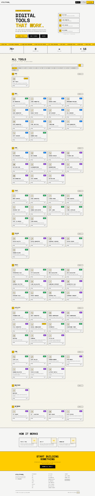
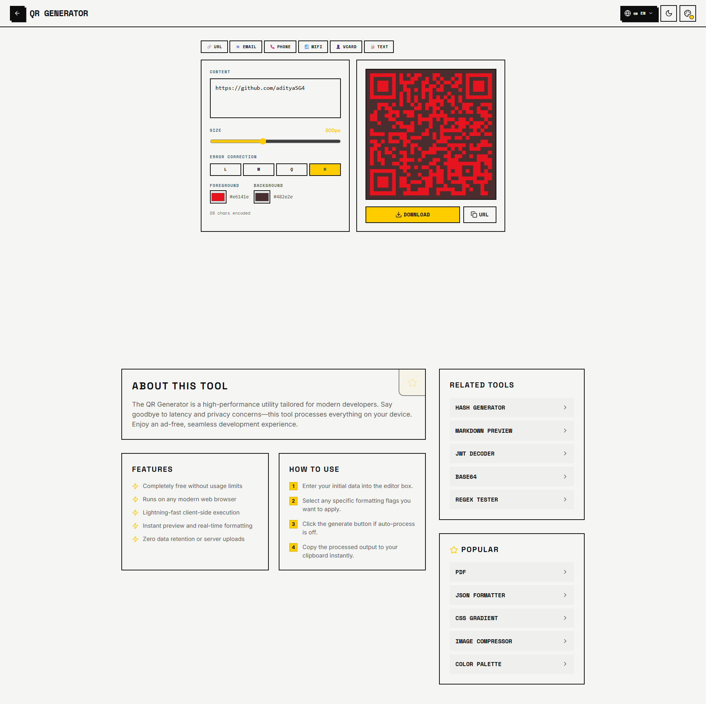
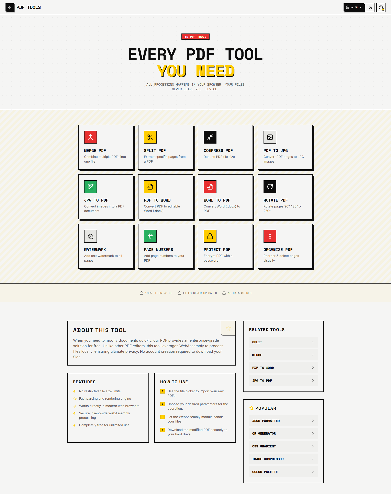
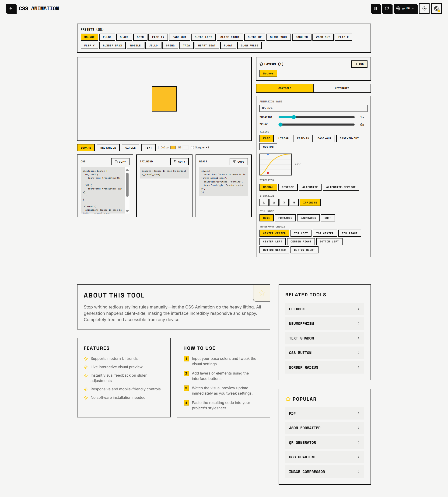

# 🚀 UtilityHubz

🔗 Live Website: https://utilityhubz.lovable.app/

UtilityHubz is a collection of **100+ free browser-based tools** designed for developers, students, and everyday users.

No sign-up. No installation. Just open and use.

---

## ✨ Features

- 🧰 100+ utility tools in one place  
- ⚡ Fast and lightweight (runs in browser)  
- 🔒 No data stored, privacy-friendly  
- 📱 Works on desktop, tablet, and mobile  
- 🎯 Clean and simple UI  

---

## 🛠️ Categories

- 📄 PDF Tools (merge, split, edit)
- 🔢 Calculators
- 🎨 CSS Generators
- 🎯 Color Tools
- 🔄 Converters (JSON, text, units, etc.)
- 🎮 Fun mini tools & games

---

## 📸 Screenshots

### 🏠 Homepage

### 🔳 QR Code Generator

### 📄 PDF Tools

### 🎨 CSS Animation Generator

---

## 🚀 Why UtilityHubz?

Most online tools:
- Require login ❌  
- Are slow ❌  
- Spam ads ❌  

UtilityHubz is built to be:
- Fast ✅  
- Free ✅  
- Simple ✅  

---

## 🧑‍💻 Tech Stack

- HTML, CSS, JavaScript  
- Modern frontend tooling (Vite)  

---

## 🌍 Use Cases

- Developers formatting JSON or generating CSS  
- Students working with PDFs or calculations  
- Anyone needing quick online tools without hassle  

---

## 📢 Feedback & Contributions

If you have ideas, suggestions, or found a bug, feel free to:
- Open an issue  
- Submit a pull request  

---

## ⭐ Support

If you find this useful, consider giving it a ⭐ on GitHub — it helps others discover the project.

---

## 📬 Connect

Have feedback or ideas? Reach out or open an issue.

---
